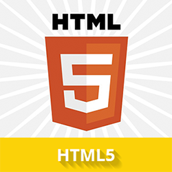

| [HTML5](homework.md) |
| :------------- |
| ***1.11. Семантические элементы HTML5*** |
| [1.11.1. Элемент документа](1.11.1.md) |
| 1.11.2. ... |
| 1.11.3. ... |
| 1.11.4. ... |

## 1.11. Семантические элементы HTML5

#### Опубликовано: 26 октября 2014 Обновлено: 18 марта 2020



**Семантические элементы HTML5** доступно описывают свой смысл или назначение как для браузеров, так и для веб-разработчиков.

До появления стандарта HTML5 вся разметка страниц осуществлялась преимущественно с помощью элементов `<div>`, которым присваивали классы `class` или идентификаторы `id` для наглядности разметки (например, `<div id="header">`). 
С их помощью в HTML-документе размещали верхние и нижние колонтитулы, боковые панели, навигацию и многое другое.

 Стандарт HTML5 предоставил новые элементы для структурирования, группировки контента и разметки текстового содержимого. Новые семантические элементы позволили улучшить структуру веб-страницы, добавив смысловое значение заключенному в них содержимому (было `<div id="header">`, стало `<header>`). Для отображения внешнего вида элементов не задано никаких правил, поэтому элементы можно стилизовать по своему усмотрению. Для всех элементов доступны <u>глобальные атрибуты</u>.

Согласно спецификации HTML5 каждый элемент принадлежит к определенной (ноль или более) категории. Каждая из них группирует элементы со схожими характеристиками. Выделяют следующие общие категории:

* Метаданные
* Потоковое содержимое
* Секционное содержимое
* Заголовочное содержимое
* Текстовое содержимое
* Встроенное содержимое
* Интерактивное содержимое

## Описание HTML5-элементов

| Содержание: |
| :---------- |
| 1. Элемент `<time>` |
| 2. Элемент `<mark>` |
| 3. Элемент `<bdi>` |
| 4. Элемент `<wbr>` |
| 5. Элементы для описания Восточно-Азиатских символов |

### 1. Элемент <time>

Категории контента: потоковое содержимое, текстовое содержимое.
Определяет время (24 часа) или дату по григорианскому календарю с возможным указанием времени и смещения часового пояса. Текст, заключенный в данный тег, не имеет стилевого оформления браузером. Для тега доступен атрибут `datetime`, в качестве содержимого которого указывается то, что будет видеть пользователь на экране своего компьютера:

```html
<time datetime="2014-09-25"> 25 Сентября 2014</time>
```

Чтобы дата могла считываться автоматически, она должна быть в формате `YYYY-MM-DD`. Время, которое также может указываться, задается в формате `HH:MM` с добавлением разделяющего префикса `T` (time): 

```html
<time datetime="2014-09-25T12:00"> 25 Сентября 2014</time>
```

### 2. Элемент <mark>

Категории контента: потоковое содержимое, текстовое содержимое.
Текст, помещенный внутрь тега `<mark>`, выделяется по умолчанию желтым цветом (цвет фона и цвет шрифта в выделенном блоке можно изменить, задав определенные css-стили). С помощью данного тега можно отмечать важное содержимое, а также ключевые слова.

### 3. Элемент <bdi>

Категории контента: потоковое содержимое, текстовое содержимое.
Отделяет фрагмент текста, который должен быть изолирован от остального текста для двунаправленного форматирования текста. Используется для текстов, написанных одновременно на языках, читающихся слева направо и справа налево.

### 4. Элемент <wbr>

Категории контента: потоковое содержимое, текстовое содержимое.
Одиночный тег, показывает браузеру место, где можно добавить разрыв длинной строки в случае необходимости.

### 5. Элементы для описания Восточно-Азиатских символов

Категории контента: потоковое содержимое, текстовое содержимое.
Элемент `<ruby>` позволяет помечать один и более элементов категории текстовое содержимое с помощью ruby-аннотации. Ruby-аннотация используется в преимущественно в Восточно-Азиатской типографики как руководство по произношению или для включения других характеристик. Элемент может содержать:
— один и более текстовых узлов или элементов `<rb>`;
— один и более элементов `<rt>`, `<rtc>`, каждый из которых предшествует или следует непосредственно за элементом `<rp>`.

Элементы `<rb>`, `<rt>`, `<rtc>` и `<rp>` не относятся ни к одной категории контента.

Элемент `<rb>` определяет вложенный в него текст как базовый компонент аннотации.
Элемент `<rt>` выводит аннотацию к тексту сверху или снизу над ним.
Элемент `<rtc>` отмечает вложенный в него текст как дополнительную аннотацию.
Элемент `<rp>` выводит альтернативный текст в случае если браузер не поддерживает элемент `<ruby>`.